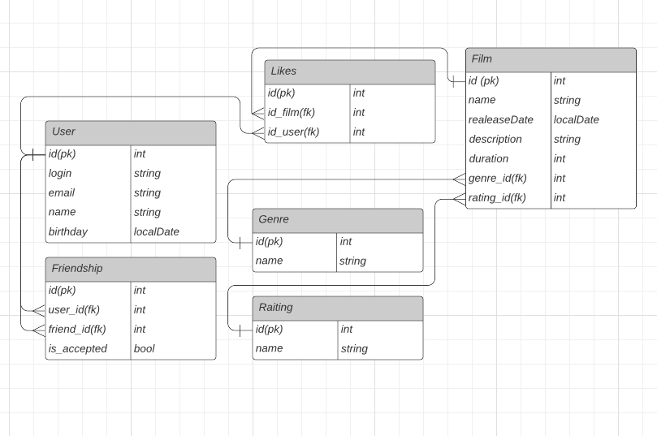

# java-filmorate

Template repository for Filmorate project.

# База данных 


## Примеры запросов

- Получение подтвержденных друзей
```roomsql
    SELECT 
        f.friend_id
    FROM friendship AS f
    JOIN user AS u ON u.id == f.user_id
    WHERE f.is_accepted == true;
```

- Получение исходящих заявок
```roomsql
    SELECT 
        f.user_id
    FROM friendship AS f
    JOIN user AS u ON u.id == f.friend_id
    WHERE f.is_accepted == false;
```

- Получение исходящих заявок
```roomsql
    SELECT 
        f.friend_id
    FROM friendship AS f
    JOIN user AS u ON u.id == f.user_id
    WHERE f.is_accepted == false;
```

- Получение фильмов которым поставил лайки
```roomsql
    SELECT 
        l.id_film
    FROM likes AS l
    JOIN user AS u ON u.id == l.user_id;
```

- Получение лайков у фильма
```roomsql
    SELECT 
        f.name,
        COUNT(l.id)
    FROM film AS f
    LEFT JOIN likes AS l ON f.id == l.id_film
    GROUP BY f.name;
```