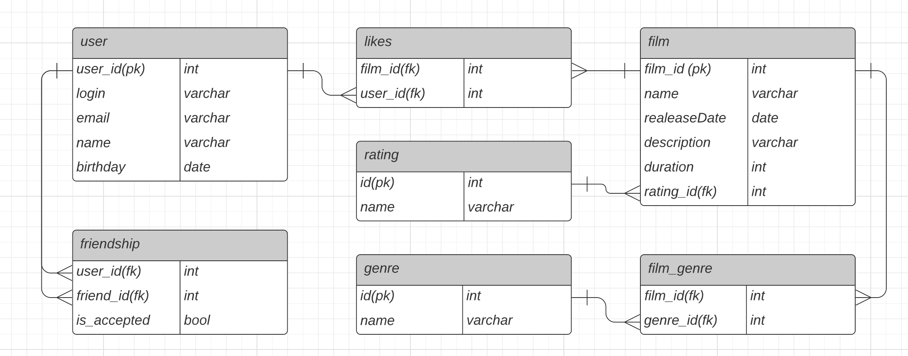

# java-filmorate

Template repository for Filmorate project.

# База данных



## Возможности приложения
###
### ***Лента событий пользователя***
- Просмотр последний событий пользователя на платформе - добавление/удаление друзей, лайков и отзывов.
```
 GET /users/{id}/feed 
 ```
###
### ***Общие фильмы***
- Вывод общих фильмов пользователя и его друга с сортировкой по их популярности.
```
 GET /films/common?userId={userId}&friendId={friendId} 
 ```
### 
### ***Популярный фильмы***
- Вывод топ-N фильмов по количеству лайков с возможностью указать жанр и год выхода фильма
```
GET /films/popular?count={limit}&genreId={genreId}&year={year}
 ```
### *** Отзывы на фильмы ***

Добавленные отзывы имеют рейтинг и несколько дополнительных характеристик:

- При создании отзыва рейтинг равен нулю.
- Оценка — полезно/бесполезно.
- Тип отзыва — негативный/положительный.

Если пользователь оценил отзыв как полезный, это увеличивает его рейтинг на 1. Если как бесполезный, то уменьшает на 1.

Отзывы сортируются по рейтингу полезности.
